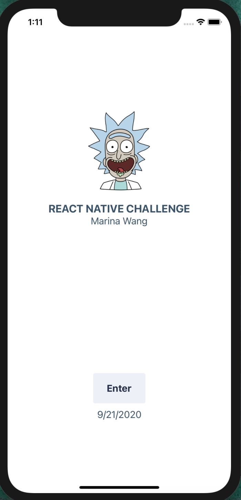
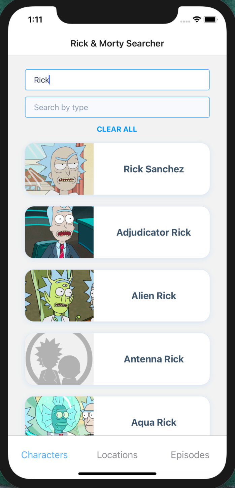
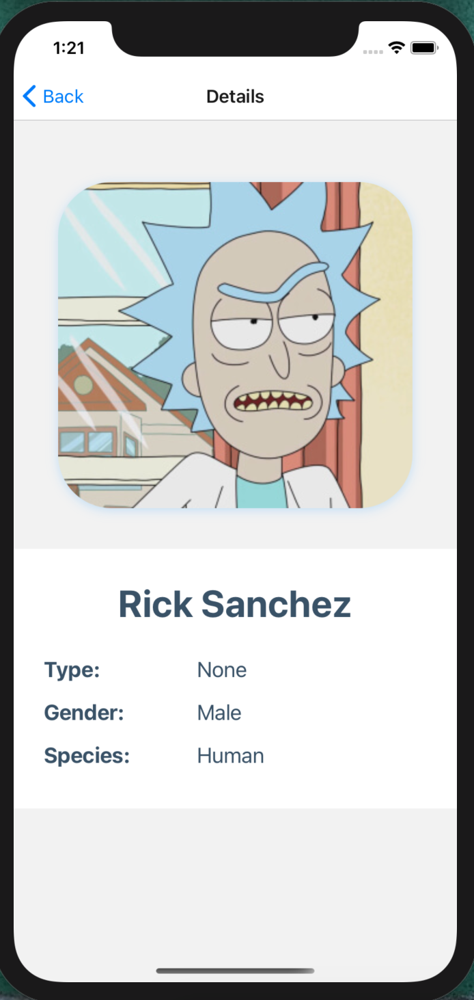

---
---

Hi there, I’m Marina! 👋

<h1 id="this-is-an-awesome-rick--morty-searcher">This is an awesome Rick &amp; Morty Searcher</h1>

You can find any interesting information about the show <strong>Rick &amp; Morty</strong> using one of the three filters provided. One for characters, one for locations and another for episodes. Find anything you want by typing in the name or type.

Flow my steps, clone the project and have fun with it!

<em><strong>Note that the app has only been tested with ios</strong></em>

<strong>Ready? Fire!</strong> 🚀

<ol>
<li>

<strong>Clone</strong>  the projct by entering the next command in your  <code>command shell</code>  <em>(make sure you have  <a href="https://git-scm.com/downloads" title="https://git-scm.com/downloads">git</a>  intalled in your computer)</em>  and then press  <strong>Enter</strong>

<code>$ git clone https://github.com/marinawangmw/ReactNative-challenge-marina.git</code>

</li>
<li>

Step into the folder cloned 
<code>cd ReactNative-challenge-marina</code>

</li>
<li>

Build all the packages and libraries 
<code>npm install</code>

</li>
<li>

Build neccesary tools for ios <em>(make sure you have Cocoapods installed)</em> 
<code>cd ios</code> 
<code>pod install</code>

</li>
<li>

Once it is built, return to the previous folder 
<code>cd ..</code>

</li>
<li>

Run the metro bundler 
<code>npx react-native start</code>

</li>
<li>

In a new terminal, positioned in the cloned repository folder, run the app 
<code>npx react-native run-ios</code>

</li>
</ol>

Hooray! And it is running! 🌹

<h1 id="🕵️‍♀️-what-you-can-do-with-this-app">🕵️‍♀️ What you can do with this app</h1>

The app consists of three screens: 
 
<strong>Introduction Screen</strong> 
Simply press the enter button to discover more~

 
 

<strong>Search Screen</strong> 
The searcher will start looking for matching results from the third character typed in.

 
 

<strong>Details Screen</strong> 
When any result card is pressed, a modal will open providing more details about the selected item.

 
 

<strong>Have fun!</strong> 🥳

